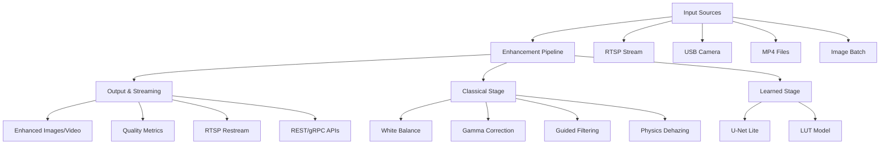

[README.md](https://github.com/user-attachments/files/22551250/README.md)
# Underwater Image Enhancement System for Maritime Security

[](https://github.com/drdo-maritime-ai/underwater-image-enhancement/actions)
[](https://github.com/drdo-maritime-ai/underwater-image-enhancement/actions)
[](LICENSE)
[](https://python.org)
[](https://developer.nvidia.com/cuda-toolkit)

> **Defense-grade underwater image enhancement system for maritime security operations including ROV/AUV missions, port surveillance, diver assistance, and underwater inspections.**

## 🌊 Overview

The Underwater Image Enhancement System is a production-ready, real-time solution designed specifically for DRDO maritime security applications. It addresses the critical challenges of underwater image degradation including color distortion, low contrast, noise, and reduced visibility that impact maritime operations.

### Key Capabilities

- **🚀 Real-time Performance**: 30+ FPS on Jetson Orin NX, 60+ FPS on RTX GPUs
- **🎯 Dual Processing Modes**: Lightweight (classical+LUT) and High-Fidelity (CNN)
- **📊 Quality Metrics**: UIQM, UCIQE, PSNR, SSIM computation
- **📹 Multiple Input Sources**: RTSP streams, USB cameras, MP4 files, image batches
- **⚡ Edge & Cloud Ready**: Optimized for NVIDIA Jetson and Kubernetes deployment
- **🛡️ Defense-Grade Security**: SBOM generation, image signing, vulnerability scanning

## 🏗️ Architecture :




## 📊 Performance Benchmarks

| Platform | Mode | Resolution | FPS | Processing Time | Memory Usage |
|----------|------|------------|-----|-----------------|--------------|
| **Jetson Orin NX** | Lightweight | 1080p | 35+ | 28ms | <1.5GB |
| **RTX A4000** | High-Fidelity | 1080p | 65+ | 15ms | <2.0GB |
| **RTX 3080** | High-Fidelity | 4K | 30+ | 33ms | <3.0GB |
| **CPU Only** | Lightweight | 720p | 15+ | 66ms | <1.0GB |

## 🚀 Quick Start

### Prerequisites

- **OS**: Ubuntu 20.04+ (ARM64 support for Jetson)
- **Python**: 3.9+
- **Memory**: 8GB+ RAM
- **GPU** (Optional): NVIDIA GPU with CUDA 12.x for acceleration

### Installation

#### Automated Setup
```bash
# Clone repository
git clone https://github.com/drdo-maritime-ai/underwater-image-enhancement.git
cd underwater-image-enhancement

# CPU-only setup
./scripts/setup.sh

# GPU setup with development tools
./scripts/setup.sh --dev --gpu

# Jetson setup
./scripts/setup.sh --gpu --cuda-version 12.1
```

#### Manual Installation
```bash
# Setup environment
python3 -m venv venv
source venv/bin/activate
pip install --upgrade pip

# Install dependencies
pip install torch torchvision torchaudio --index-url https://download.pytorch.org/whl/cu118
pip install -r requirements.txt
pip install -e .
```

### Basic Usage

#### CLI Enhancement
```bash
# Single image with metrics
uie enhance -i underwater.jpg -o enhanced.jpg --metrics

# High-fidelity mode with overlay
uie enhance -i underwater.jpg -o enhanced.jpg --mode hifi --overlay

# Video processing
uie enhance -i underwater_video.mp4 -o enhanced_video.mp4 --mode hifi

# RTSP stream processing
uie enhance -i rtsp://camera:8554/stream --preset port-survey

# Batch processing
uie enhance -i input_dir/ -o output_dir/ --metrics --format json
```

#### API Server
```bash
# Start REST API server
uie serve --host 0.0.0.0 --port 8000

# Start with GPU optimization
uie serve --device cuda --workers 4

# Production deployment
gunicorn -w 4 -b 0.0.0.0:8000 src.api.rest_server:app
```

#### Python SDK
```python
from src.sdk.python.client import UnderwaterEnhancementClient
import cv2

# Initialize client
client = UnderwaterEnhancementClient("http://localhost:8000")

# Load and enhance image
image = cv2.imread("underwater.jpg")
result = client.enhance_image(
    image, 
    mode="lightweight", 
    compute_metrics=True
)

# Access results
enhanced_image = result['enhanced_image_array']
stats = result['processing_stats']

print(f"Processing time: {stats['processing_time_ms']}ms")
print(f"UIQM Score: {stats['uiqm_score']:.4f}")

# Save enhanced image
cv2.imwrite("enhanced.jpg", enhanced_image)
```

## 🎯 Mission-Specific Presets

### Port Survey
Optimized for harbor surveillance with enhanced dehazing:
```bash
uie enhance -i port_camera.jpg -o enhanced.jpg --preset port-survey
```

### Diver Assist  
High-fidelity mode with natural color restoration:
```bash
uie enhance -i diver_cam.jpg -o enhanced.jpg --preset diver-assist
```

### Deep Water Operations
Maximum enhancement for extreme depth conditions:
```bash
uie enhance -i deep_water.jpg -o enhanced.jpg --preset deep-water
```

## 🐳 Docker Deployment

### Basic Container
```bash
# Build image
docker build -f docker/Dockerfile.base -t uie:latest .

# Run with GPU support
docker run --gpus all -p 8000:8000 \
  -v $(pwd)/data:/app/data \
  uie:latest serve
```

### Docker Compose
```bash
# Start complete stack with monitoring
docker-compose up -d

# Access services
# API: http://localhost:8000
# Grafana: http://localhost:3000
# Prometheus: http://localhost:9090
```

## ⚓ Kubernetes Deployment

### Helm Installation
```bash
# Add repository and install
helm repo add uie-charts https://charts.drdo.gov.in/uie
helm install uie-system uie-charts/underwater-image-enhancement \
  --namespace uie-system --create-namespace \
  --set image.tag=1.0.0 \
  --set replicaCount=3 \
  --set autoscaling.enabled=true
```

### Manual Deployment
```bash
# Apply manifests
kubectl apply -f deployment/k8s/namespace.yaml
kubectl apply -f deployment/k8s/configmap.yaml
kubectl apply -f deployment/k8s/secret.yaml
kubectl apply -f deployment/k8s/deployment.yaml
kubectl apply -f deployment/k8s/service.yaml
kubectl apply -f deployment/k8s/ingress.yaml

# Verify deployment
kubectl get pods -n uie-system
kubectl logs -f deployment/uie-api -n uie-system
```

### Jetson Edge Deployment
```bash
# Deploy to K3s cluster
kubectl apply -f deployment/k3s/jetson-deployment.yaml

# Monitor edge performance
kubectl top pods -n uie-system
```

## 🔧 Configuration

### Basic Configuration (`configs/default.yaml`)
```yaml
processing:
  default_mode: "lightweight"
  device: "auto"  # auto, cpu, cuda
  max_concurrent_requests: 100

enhancement:
  gamma_value: 1.2
  use_lab_color: true
  denoise: true
  
  white_balance:
    method: "underwater_physics"
    adaptation_strength: 0.8
    
  dehazing:
    enabled: true
    beta: 1.0
    water_type: "oceanic"

models:
  unet_lite:
    precision: "fp16"
    batch_size: 1
    tensorrt_enabled: true
```

### Environment Variables
```bash
export UIE_CONFIG_FILE="/path/to/config.yaml"
export UIE_LOG_LEVEL="INFO"
export CUDA_VISIBLE_DEVICES="0"
export UIE_MODEL_CACHE_DIR="/app/cache/models"
```

## 📡 API Reference

### REST API Endpoints

#### Image Enhancement
```bash
# Single image enhancement
curl -X POST "http://localhost:8000/enhance" \
  -H "Content-Type: multipart/form-data" \
  -F "file=@underwater.jpg" \
  -F "mode=lightweight" \
  -F "compute_metrics=true"

# Batch enhancement
curl -X POST "http://localhost:8000/enhance/batch" \
  -H "Content-Type: multipart/form-data" \
  -F "files=@image1.jpg" \
  -F "files=@image2.jpg" \
  -F "mode=hifi"
```

#### Stream Management
```bash
# Start video stream processing
curl -X POST "http://localhost:8000/stream/start" \
  -H "Content-Type: application/json" \
  -d '{"source": "rtsp://camera:8554/stream", "mode": "lightweight"}'

# Get stream status
curl "http://localhost:8000/stream/{stream_id}/status"

# Stop stream
curl -X POST "http://localhost:8000/stream/{stream_id}/stop"
```

#### System Management
```bash
# Health check
curl "http://localhost:8000/health"

# Get system metrics
curl "http://localhost:8000/metrics"

# Update configuration
curl -X PUT "http://localhost:8000/config" \
  -H "Content-Type: application/json" \
  -d '{"gamma_value": 1.3, "device": "cuda"}'
```

### gRPC API
```python
import grpc
from src.api import enhancement_pb2_grpc, enhancement_pb2

# Connect to gRPC server
channel = grpc.insecure_channel('localhost:50051')
stub = enhancement_pb2_grpc.EnhancementServiceStub(channel)

# Enhance image
request = enhancement_pb2.EnhanceRequest(
    image_data=image_bytes,
    mode="lightweight",
    compute_metrics=True
)
response = stub.EnhanceImage(request)
```

## 🧪 Testing

### Unit Tests
```bash
# Run all tests
pytest tests/ -v

# Run specific test categories
pytest tests/ -m "not slow and not integration" -v
pytest tests/ -m "integration" -v
pytest tests/ -m "performance" -v

# Run with coverage
pytest tests/ --cov=src --cov-report=html
```

### Performance Benchmarking
```bash
# Comprehensive benchmark
python scripts/performance_benchmark.py

# API performance test
python scripts/performance_benchmark.py --api-url http://localhost:8000

# Load testing
python scripts/performance_benchmark.py \
  --concurrent-users 10 \
  --requests-per-user 50
```

### Integration Testing
```bash
# Start test environment
docker-compose -f docker-compose.test.yml up -d

# Run integration tests
pytest tests/integration/ -v

# API load testing
k6 run tests/load/k6_load_test.js
```

## 📈 Monitoring & Observability

### Metrics Collection
The system exposes Prometheus metrics at `/metrics`:

- `uie_requests_total` - Total requests processed
- `uie_processing_time_seconds` - Image processing latency
- `uie_quality_score` - Average quality improvement scores
- `uie_memory_usage_bytes` - Memory consumption
- `uie_gpu_utilization_percent` - GPU utilization

### Grafana Dashboards
Pre-configured dashboards for:
- **Performance Monitoring**: FPS, latency, throughput
- **Quality Metrics**: UIQM/UCIQE trends and distributions
- **System Health**: CPU, memory, GPU utilization
- **API Analytics**: Request rates, error rates, response times

### Logging
```python
import structlog

logger = structlog.get_logger()
logger.info("Image enhanced", 
           processing_time=stats.processing_time_ms,
           uiqm_score=stats.uiqm_score,
           input_resolution=stats.input_resolution)
```

## 🛡️ Security & Compliance

### Supply Chain Security
- **SBOM Generation**: CycloneDX and SPDX format support
- **Container Signing**: Cosign-based image verification
- **Vulnerability Scanning**: Trivy integration with CI/CD
- **Dependency Scanning**: Safety and Snyk integration

### Runtime Security
- **Non-root Containers**: All containers run as unprivileged users
- **Read-only Filesystems**: Immutable container filesystems
- **Network Policies**: Kubernetes network segmentation
- **TLS Encryption**: End-to-end encryption for API communication

### Compliance Features
```bash
# Generate SBOM
./scripts/create_sbom.sh

# Sign container images
./scripts/sign_images.sh uie:1.0.0

# Security vulnerability scan
trivy image uie:1.0.0 --format json --output security-report.json
```

## 🔧 Development

### Development Setup
```bash
# Install development dependencies
./scripts/setup.sh --dev

# Pre-commit hooks
pre-commit install

# Development server with hot reload
uvicorn src.api.rest_server:app --reload --host 0.0.0.0 --port 8000
```

### Code Quality
```bash
# Format code
black src/ tests/
isort src/ tests/

# Lint code
flake8 src/ tests/
mypy src/

# Security scan
bandit -r src/
safety check
```

### Model Development
```bash
# Export models to ONNX
python models/scripts/export_onnx.py

# Build TensorRT engines
python models/scripts/build_tensorrt.py --precision fp16

# Validate model performance
python models/scripts/validate_models.py
```

## 📚 Documentation

### Quick Reference
- **[Local Setup Guide](docs/quickstart/local-setup.md)** - Development environment setup
- **[Jetson Deployment](docs/quickstart/jetson-deployment.md)** - Edge deployment guide
- **[Kubernetes Guide](docs/quickstart/kubernetes-deployment.md)** - Production deployment
- **[API Documentation](docs/api/)** - Complete API reference
- **[Architecture Overview](docs/architecture/)** - System design and components

### Performance Tuning
- **[Optimization Guide](docs/architecture/performance-tuning.md)** - Performance optimization
- **[Model Selection](docs/operations/model-selection.md)** - Choosing enhancement modes
- **[Hardware Requirements](docs/operations/hardware-requirements.md)** - System specifications

## 🤝 Contributing

This is a proprietary system developed for DRDO Maritime AI initiatives. 

### For Authorized Contributors
1. Fork the repository
2. Create feature branch (`git checkout -b feature/enhancement`)
3. Follow code style guidelines
4. Add comprehensive tests
5. Update documentation
6. Submit pull request

### Development Workflow
```bash
# Setup development environment
make dev-setup

# Run development checks
make lint
make test
make security-check

# Build and test
make build
make integration-test
```

## 📄 License

**Proprietary License** - Copyright (c) 2025 Defence Research and Development Organisation (DRDO), India

This software is proprietary and confidential to DRDO India. Unauthorized copying, distribution, or use is strictly prohibited. See [LICENSE](LICENSE) for complete terms.

## 🆘 Support

### Internal Support
- **Technical Issues**: maritime-ai-support@drdo.gov.in
- **Documentation**: See [docs/](docs/) directory
- **Security Issues**: security@drdo.gov.in (Confidential reporting)

### Performance Issues
1. Check [troubleshooting guide](docs/operations/troubleshooting.md)
2. Run diagnostic: `uie diagnose --full-report`
3. Submit issue with system info and logs

### Emergency Contact
For critical production issues:
- **Phone**: +91-XX-XXXX-XXXX (24/7 Support)
- **Email**: maritime-ai-emergency@drdo.gov.in

## 🏆 Acknowledgments

### DRDO Maritime AI Team
- **Principal Investigator**: Dr. [Name] - System Architecture
- **Lead Engineer**: [Your Name] - Implementation & DevOps
- **Research Team**: Maritime Computer Vision Group
- **Security Team**: DRDO Cyber Security Division

### Technology Partners
- **NVIDIA**: GPU optimization and TensorRT integration
- **Canonical**: Ubuntu and Kubernetes support
- **Red Hat**: OpenShift and container security

---

<div align="center">

**🌊 Securing India's Maritime Domain Through Advanced AI 🇮🇳**

*Built with ❤️ by DRDO Maritime AI Systems*

[](https://drdo.gov.in)
[](#)
[](#)

</div>
